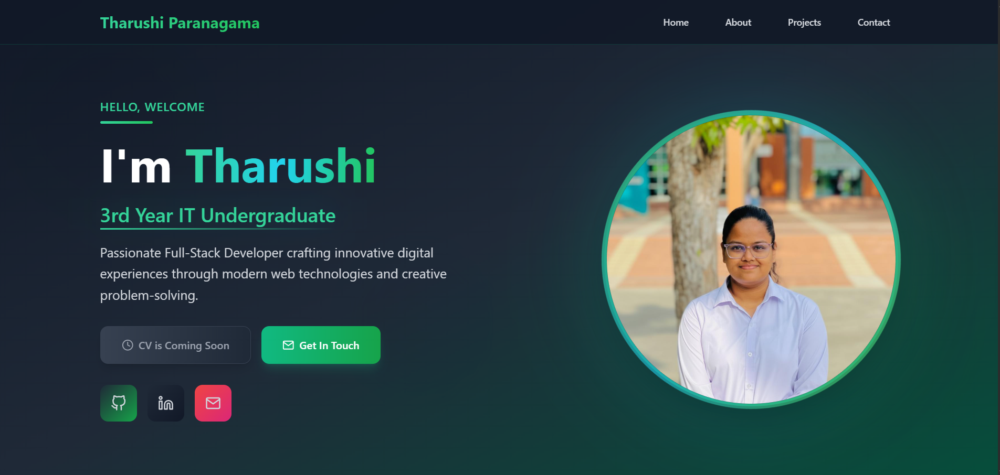

<h1 align="center">Hi 👋, I'm Tharushi Paranagama</h1>
<h3 align="center">Information Technology Undergraduate | Fullstack Developer | UI/UX Enthusiast</h3>

---

##  My Portfolio

 Live Preview: **[https://tharushi-paranagama.netlify.app/](https://tharushi-paranagama.netlify.app/)**

This is my personal portfolio website where I showcase my:

* Skills & technologies
* Academic and personal projects
* UI/UX designs
* Contact information

---

##  Features

* Clean, modern, and responsive UI
* Built with **React.js**
* Mobile-friendly design
* Smooth navigation & animations
* Contact form integration
* Deployed online for public access

---

## 🛠 Technologies Used

| Category        | Tools                 |
| --------------- | --------------------- |
| Frontend        | React.js, Tailwind CSS |
| Hosting         | Netlify      |
| Version Control | Git & GitHub          |

---

##  Preview



---

##  How to Run Locally

```bash
git clone https://github.com/Tharushi111/My-Portfolio.git
cd My-Portfolio
npm install
npm start
```

Your project will run at: **[http://localhost:3000](http://localhost:3000)**

---

##  Purpose

This portfolio was created to:

* Showcase my skills as an IT undergraduate
* Strengthen my personal brand
* Support job & internship applications
* Share my learning journey in web development

---

##  Connect With Me

* LinkedIn: www.linkedin.com/in/tharushi-paranagama-a0b657355
* Email: tharushiparanagama1@gmail.com
* Portfolio: [[https://tharushi-paranagama.netlify.app/](https://tharushi-paranagama.netlify.app/)]

---

 **If you like my work, please give this repo a star!**
